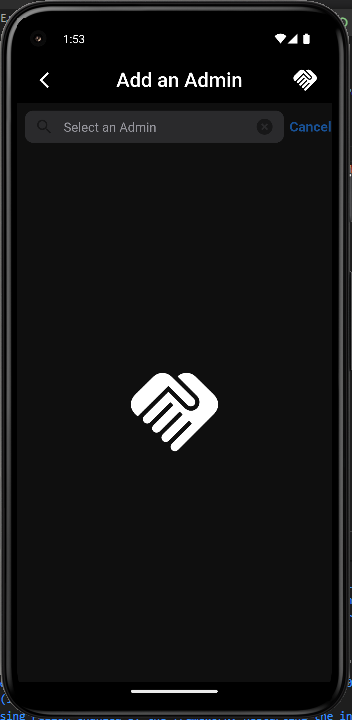
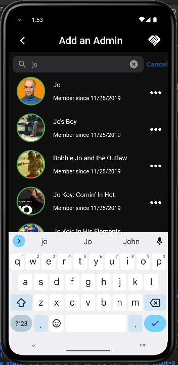
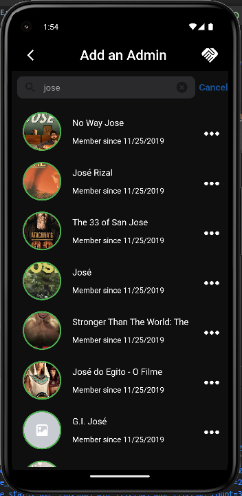
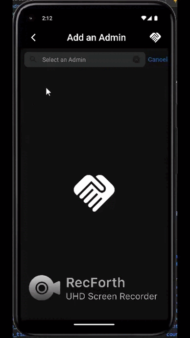
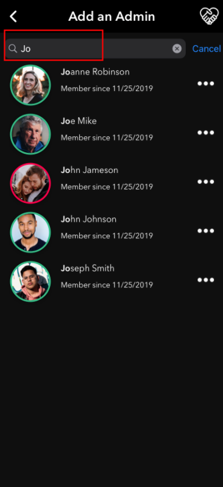

# :fire: pure_match_technical_test :fire:

# :computer: Android-IOS application Developed in Flutter to simulate dynamic searches with real-time responses while typing :computer:

## :star: Application Introduction :star:

Application built in Flutter using the Provider state management and the [TheMovieDB](https://www.themoviedb.org/) API,"The Movie Database" (TMDB) is a community-created movie and TV database, application created as part of the Flutter Developer selection process for the company [PureMatch LLC](https://apps.apple.com/us/app/pure-match/id1506240839?app=itunes&ign-mpt=uo%3D4)

## :books: Table of Contents

- [Versions](#memo-versions)
- [Dependencies](#package-dependencies)
- [Instalation](#hammer_and_wrench-instalation)
- [Releases](#artificial_satellite-releases)
- [Appearance](#camera-appearance)
- [Use](#rocket-use) 
- [Support](#hammer_and_wrench-support)
- [Contributions](#memo-contributions)
- [License](#scroll-license)

## :memo: Versions

*  Flutter version 3.3.4
*  Aplication version 1.0.0

## :package: Dependencies

* [flutter_dotenv: ^5.0.2](https://pub.dev/packages/flutter_dotenv)
* [http: ^0.13.5](https://pub.dev/packages/http)
* [provider: ^6.0.4](https://pub.dev/packages/provider) 

## :hammer_and_wrench: Instalation

**Step 0:**

Create a file named: `.env` (must be exact) at the same level as the file`.gitignore` and add your API key [TheMovieDB API](https://www.themoviedb.org/documentation/api) as shown below, no spaces:

```sh
API_KEY=********Your_API_Key********
```

**Step 1:**

Clone the repository, use the following command in terminal:

```sh
git clone https://github.com/JeancarlosCarvajal/Pure-Match-Technical-Test 
```

**Paso 2:**

Clean up old Flutter dependencies (if they exist):

```sh
flutter clean
```

**Paso 3:**

Get the dependencies setted in the pubspec.yaml file:

```sh
flutter pub get
```

**Paso 4:**

Run the application with the command:

```sh
flutter run
```

Then the terminal will ask you which device you want to display and choose one and type the corresponding number, then click enter.

## :artificial_satellite: Releases

* To create the release on Android you must follow the documentation [Build and release an Android app](https://docs.flutter.dev/deployment/android).

* To create the release on IOS you must follow the documentation [Build and release an iOS app](https://docs.flutter.dev/deployment/ios).


## :rocket: Use

* Once you have the application running, the [Main screen](https://github.com/JeancarlosCarvajal/Pure-Match-Technical-Test/blob/master/appearance/3-min.png) will show you the search input, start to write any word.

* While you are writting the App will search every word that is been created [Search result](https://github.com/JeancarlosCarvajal/Pure-Match-Technical-Test/blob/master/appearance/2-min.png) and will fill all the screen whith information related.

* You could clean the sarch by canceling it touching the "X" buttom while you are writing or touching cancel once you have finished to make a search [Details Screen](https://github.com/JeancarlosCarvajal/Pure-Match-Technical-Test/blob/master/appearance/4-min.gif).


## :camera: Appearance






### :camera: UI Guide to create the Application




## :hammer_and_wrench: Support

Please [open an issue](https://github.com/JeancarlosCarvajal/Pure-Match-Technical-Test/issues/new) for support.

## :memo: Contributions

Contribute using [Github Flow](https://guides.github.com/introduction/flow/). Create a branch and make commits and [open a pull request](https://github.com/JeancarlosCarvajal/Pure-Match-Technical-Test).

## :scroll: Licence

[MIT Licence © Jeancarlos Carvajal](https://github.com/JeancarlosCarvajal/Pure-Match-Technical-Test/blob/master/LICENCE.txt)